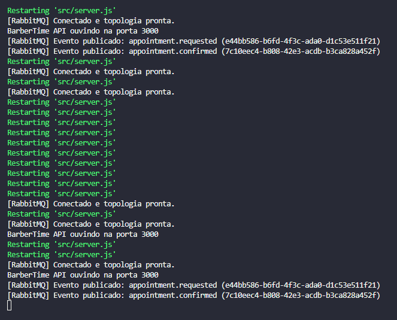
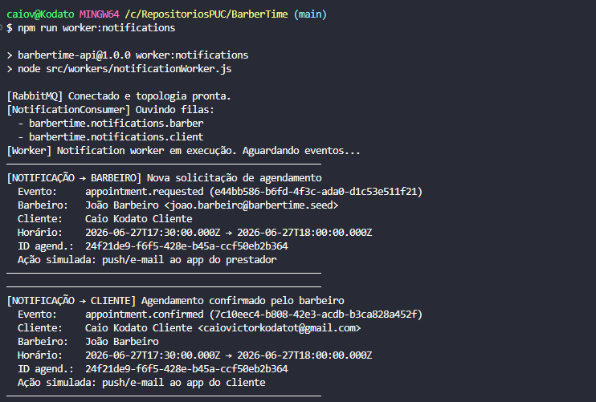
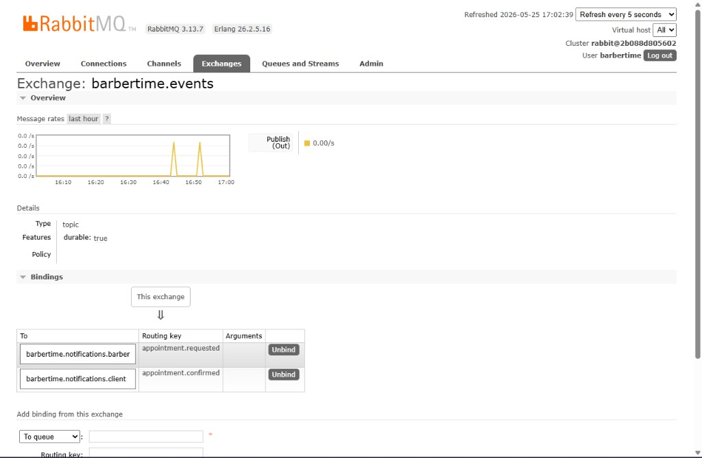
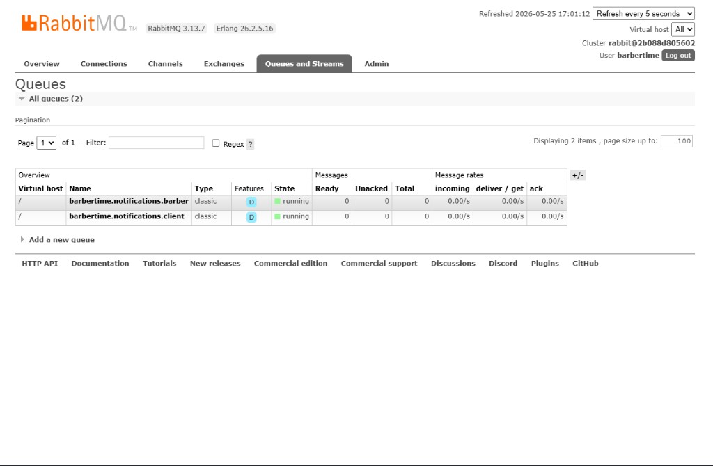

# BarberTime — Entrega Sprint 2 (Integração com MOM)

**Disciplina:** LDAMD — PUC Minas  
**Projeto:** BarberTime — agendamento em barbearia  
**Sprint:** 2 — Integração com Middleware Orientado a Mensagens  
**Aluno:** Caio Kodato  
**Data da demonstração:** 25/05/2026

---

## Objetivo da sprint

Integrar um **Middleware Orientado a Mensagens (MOM)** ao backend, com comunicação **assíncrona orientada a eventos**, conforme o Projeto Integrador LDAMD.

**Fluxo demonstrado:**

1. Cliente solicita agendamento → status `pending` → evento `appointment.requested` → notificação ao **barbeiro**.
2. Barbeiro confirma → status `confirmed` → evento `appointment.confirmed` → notificação ao **cliente**.

---

## Entregas obrigatórias e evidências

| Entrega exigida | Evidência no repositório |
|-----------------|--------------------------|
| MOM configurado e operacional | `docker-compose.yml`, Figuras 3 e 4 |
| Produtor e consumidor implementados | Figuras 1 e 2; `src/messaging/`, `src/workers/` |
| Documentação dos eventos | `EVENTOS_MOM.pdf` |
| Demonstração de assincronicidade | Figura 2 (worker em processo separado da API) |
| Relatório de integração (1 página) | `RELATORIO_INTEGRACAO_MOM.pdf` |

---

## Critérios de avaliação (20 pontos)

| Critério | Peso | Atendido | Evidência |
|----------|------|----------|-----------|
| MOM funcionando corretamente | 25% | Sim | Figuras 3 e 4; broker RabbitMQ 3.13 |
| Produtor e consumidor de eventos | 30% | Sim | Figuras 1 e 2; eventos `requested` e `confirmed` |
| Documentação dos eventos | 20% | Sim | `EVENTOS_MOM.pdf` |
| Assincronicidade real no fluxo | 15% | Sim | Worker sem chamada REST ao produtor |
| Clareza do relatório de integração | 10% | Sim | `RELATORIO_INTEGRACAO_MOM.pdf` |

---

## Arquitetura resumida

| Papel | Componente | Tecnologia |
|-------|------------|------------|
| Produtor | API Express | `EventPublisher` após persistência no PostgreSQL |
| Broker | RabbitMQ | Exchange topic `barbertime.events` |
| Consumidor | Notification Worker | `npm run worker:notifications` |
| Persistência | PostgreSQL | Agendamentos `pending` / `confirmed` |

**Agendamento demonstrado:** `24f21de9-f6f5-428e-b45a-ccf50eb2b364` — cliente Caio Kodato Cliente, barbeiro João Barbeiro, 27/06/2026 14:30–15:00 (America/Sao_Paulo).

---

## Evidências visuais

### Figura 1 — Produtor (API REST)



A API registra a publicação de `appointment.requested` e `appointment.confirmed` após as operações REST.

### Figura 2 — Consumidor (Notification Worker)



O worker, em **processo separado**, consome as filas e simula notificação ao barbeiro e ao cliente.

### Figura 3 — Painel RabbitMQ (exchange e bindings)



Exchange **topic** `barbertime.events` com roteamento para as filas de notificação.

### Figura 4 — Painel RabbitMQ (filas)



Filas duráveis em execução; mensagens consumidas após os testes (Ready = 0).

**Painel:** http://localhost:15673 — usuário e senha `barbertime`.

---

## Como reproduzir

```text
docker compose up -d
npm run worker:notifications
npm run dev
```

**Postman:** register → available-slots → POST /appointments → login barbeiro → PATCH confirm.

**Coleção:** `postman/BarberTime.postman_collection.json`

---

*BarberTime — Sprint 2 — LDAMD — PUC Minas — Engenharia de Software.*
