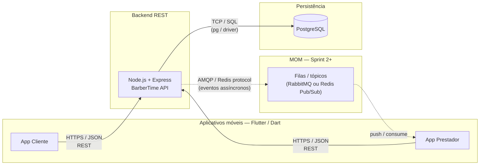

# Diagrama de Arquitetura — BarberTime (visão Sprint 1 + roadmap)

A disciplina exige **app cliente Flutter**, **app prestador Flutter**, **backend REST** (Node/Express), **MOM** (ex.: RabbitMQ) e **banco de dados**. Na Sprint 1 o escopo entregue é o **backend REST** e o **PostgreSQL**; MOM e apps aparecem na arquitetura alvo.

## Visão de componentes e protocolos

### Legenda de protocolos

| Trecho | Protocolo / formato |
|--------|----------------------|
| Apps ↔ API | **HTTPS**, corpo **JSON**, estilo **REST** |
| API ↔ PostgreSQL | **TCP**, consultas **SQL** (driver `pg`) |
| API ↔ MOM (futuro) | **AMQP** (RabbitMQ) ou **Redis** (pub/sub), conforme escolha na Sprint 2 |

## Responsabilidades por componente (resumo)

- **App cliente:** UX de cadastro, login, busca de horários e confirmação de agendamento.  
- **App prestador:** agenda e ações sobre pedidos; na Sprint 1 ainda não implementado.  
- **Backend:** regras de negócio (autenticação JWT, grade de horários, anti-conflito), persistência.  
- **MOM:** desacoplamento e notificações assíncronas (ex.: `appointment.created`); **Sprint 2**.  
- **PostgreSQL:** usuários, barbeiros, agendamentos e índices de unicidade para consistência.
