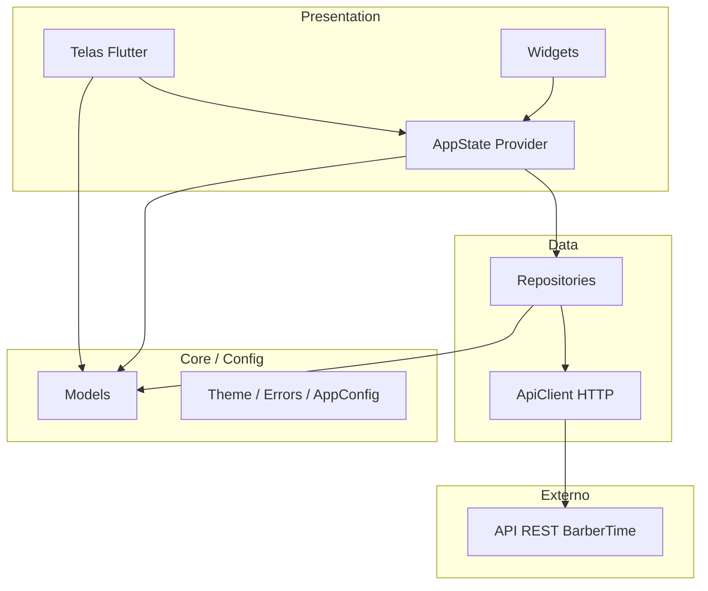
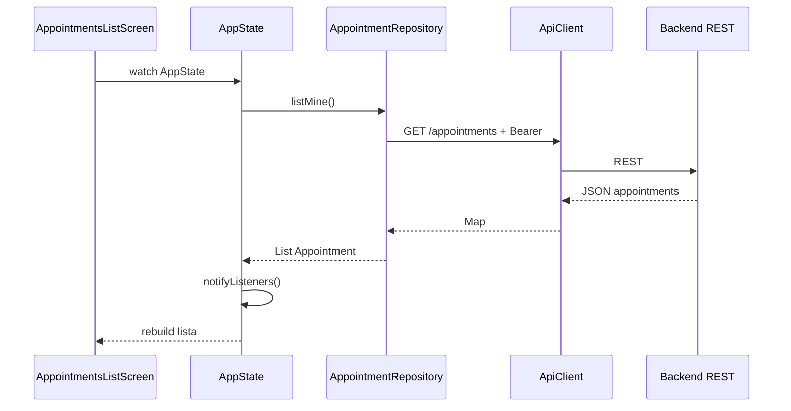
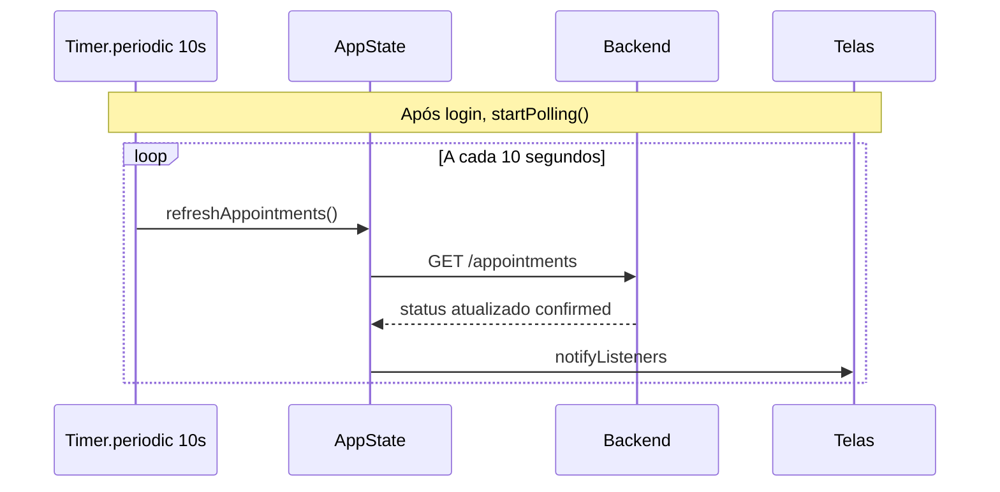

# BarberTime — Arquitetura Mobile (Clean Architecture)

**Sprint 3 — App Flutter Cliente**

---

## 1. Visão em camadas

O app segue **Clean Architecture simplificada**: regras de apresentação separadas de acesso a dados; modelos de domínio independentes de HTTP.



---

## 2. Responsabilidade de cada camada

| Camada | Pasta | Responsabilidade |
|--------|-------|------------------|
| **Presentation** | `lib/presentation/` | UI, navegação, estado reativo (`ChangeNotifier`) |
| **Data** | `lib/data/` | HTTP, serialização JSON, chamadas REST |
| **Models** | `lib/models/` | Entidades (`User`, `Appointment`, `Barber`, slots) |
| **Core** | `lib/core/` | Tema, exceções compartilhadas |
| **Config** | `lib/config/` | URL base, polling, chaves SharedPreferences |

**Regra de dependência:** Presentation → Data → API externa. Models e Core não dependem de Flutter widgets.

---

## 3. Fluxo de dados — listar agendamentos



---

## 4. Fluxo — polling (atualização assíncrona)



---

## 5. Mapeamento REST ↔ Repository

| Repository | Rotas |
|------------|-------|
| `AuthRepository` | `POST /api/v1/auth/login`, `/register` |
| `AppointmentRepository` | `GET/POST /api/v1/appointments`, `PATCH .../cancel` |
| `BarberRepository` | `GET /api/v1/barbers` |
| `AvailabilityRepository` | `GET /api/v1/availability/available-slots` |

---

## 6. Decisões de design

1. **Provider em vez de BLoC** — escopo acadêmico reduzido; um `AppState` centraliza auth, lista e polling.
2. **Polling em vez de WebSocket/MOM no app** — backend já publica eventos no RabbitMQ (Sprint 2); o cliente mobile consome o **estado persistido** via REST, adequado para MVP.
3. **SharedPreferences** — persiste JWT entre sessões; usuário serializado em JSON para restaurar login.
4. **ApiClient único** — injeta `baseUrl` e `token`; repositories permanecem testáveis.

---

## 7. Diagrama de pacotes (lib/)

```
lib/
├── main.dart
├── config/app_config.dart
├── core/
│   ├── errors/api_exception.dart
│   └── theme/app_theme.dart
├── models/
├── data/
│   ├── api/api_client.dart
│   └── repositories/
└── presentation/
    ├── providers/app_state.dart
    ├── screens/
    └── widgets/
```
